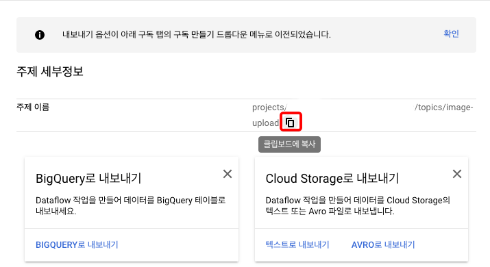

# [KR] real-time image analysis system with GCP


## Cloud Run으로 파일 업로드 서비스 작성


 Cloud Run의 웹페이지에서 업로드한 이미지를 Cloud Storage의 지정된 버킷에 저장하는 서비스를 작성합니다.

1. 업로드된 이미지를 저장하기 위해서 탐색메뉴 -\> Storage -\> 브라우저 로 이동합니다.


2. 버킷 만들기를 클릭해서 업로드된 이미지를 저장할 버킷을 작성합니다.


3. 유니크한 버킷명을 만들기 위해서 버킷명으로 PROJECT\_ID + ‘-image-upload' 로 지정합니다 (예: minsooproject-image-upload). ‘데이터 저장 위치 선택'에서 위치 유형은 ‘Region'을 위치를 ‘asia-northeast1(도쿄)'를 선택합니다. ‘만들기' 버튼을 클릭해서 버킷을 작성합니다.
\* 위치 유형과 위치는 다른 값이라도 상관없습니다.


4. 버킷이 작성된후 버킷명 옆의 아이콘을 클릭해서 버킷명을 복사해서 메모 합니다. 이 버킷명은 잠시후 어플리케이션 구성에서 사용합니다.


5. Cloud Run에서 어플리케이션을 작성하기 위해서 Cloud Shell을 활성화 합니다. Cloud Shell은 각 계정에 부여 되는 미니 VM환경으로 무료로 사용이 가능합니다.


6. Cloud Shell에서 github에서 샘플 소스를 Clone 합니다. \[ [GitHub에서 보기](https://github.com/mcowger/gcs-file-uploader)\]


```
git clone https://github.com/mcowger/gcs-file-uploader
```

7. 소스 디렉토리에 이동한 후 main.py의 내용을 확인해 봅니다. (변경은 없습니다.)


```
cd gcs-file-uploader/
less main.py
```

main.py의 내용중 아래의 부분의 설정은 Dockerfile에서 정의 할 것입니다.

화면의 UI를 담당하는 파일은 ‘less templates/signedurl.html'로 확인 가능합니다.

8. Dockerfile 를 편집 모드로 열어서 ‘BUCKET\_NAME'의 변수값을 앞서 메모해둔 자신의 버킷경로로 변경 후 내용을 저장합니다.


```
vim Dockerfile
```


9. 이 후의 작업을 편하게 하기 위해서 일부 값을 Cloud Shell의 환경 변수에 등록합니다.


```bash
#PROJECT_NAME에  PROJECT_ID를 설정합니다.
PROJECT_NAME=$(gcloud config list --format="value(core.project)")

#앞서 메모해둔 버킷의 경로를 BUCKET_NAME에 설정합니다.
BUCKET_NAME=<< YOUR BUCKET_NAME >>
```

10. Cloud Run에서 GCS(Google Cloud Storage)의 버킷에 쓰기 권한을 부여할 서비스 어카운트를 작성해서 권한을 부여합니다.


```
#urlsigner라는 서비스 어카운트명으로 등록합니다.
gcloud iam service-accounts create urlsigner --display-name="GCS URL Signer" --project=${PROJECT_NAME}
```


```
#작성한 서비스 어카운트의 키 파일을 작성해서 다운로드 합니다.
gcloud iam service-accounts keys  create service_account.json --iam-account=urlsigner@${PROJECT_NAME}.iam.gserviceaccount.com
```

```
#service_account.json 라는 이름으로 파일이 정상적으로 다운로드 된 것을 확인합니다.
ls
```

출력예:


```bash
cors.txt  Dockerfile  main.py  public  README.MD  requirements.txt  service_account.json  templates
```

11. 작성한 서비스 어카운트에 버킷에 대해서 어드민 권한을 부여합니다.


```
gsutil iam ch  serviceAccount:urlsigner@${PROJECT_NAME}.iam.gserviceaccount.com:roles/storage.admin gs://$BUCKET_NAME
```

12. 버킷에 CORS 설정 파일을 등록합니다.


```
gsutil cors set cors.txt gs://$BUCKET_NAME
```

출력예:


```bash
Setting CORS on gs://handson-run-gcs-psub-functions-image-upload/...
```

13. 다운로드한 소스를 빌드한 후 uploadr라는 이름으로 Container Registry에 등록합니다.


```
docker build -t gcr.io/$PROJECT_NAME/uploader . && docker push gcr.io/$PROJECT_NAME/uploader:latest
```

출력예:


```bash
Sending build context to Docker daemon  101.9kB
Step 1/6 : FROM python:3.7-slim
3.7-slim: Pulling from library/python
bf5952930446: Pull complete
385bb58d08e6: Pull complete
...
...
58981daebc1e: Pushed
b0fd604cedbb: Pushed
e7373400375e: Pushed
04499382c9c9: Pushed
7a08b2bb049b: Pushed
2b99e2403063: Layer already exists
d0f104dc0a1f: Layer already exists
latest: digest: sha256:85785c6e5ce1ae45117f916e2b4264eea2470ad6e5723d42d8f1c9b3861164ae size: 1791
```

14. Cloud Run을 managed 로 asia-northeast1에 배포 합니다.


```
gcloud run deploy uploader --image gcr.io/$PROJECT_NAME/uploader:latest --platform managed --region asia-northeast1
```

사전에 API가 유효화 되어 있지 않으면 아래와 같은 메시지가 출력됩니다. ‘y'를 입력해서 유효화를 합니다.


```bash
API [run.googleapis.com] not enabled on project [000000000]. Would
you like to enable and retry (this will take a few minutes)? (y/N)?  y
```

일반 공개를 하겠습니까? 라는 메시지가 나오면 ‘y'를 입력해서 외부에서 접속 가능하게 합니다.


```bash
Operation "operations/acf.8b22d723-4c50-450b-9778-1b4166eb90f1" finished successfully.
Allow unauthenticated invocations to [uploader] (y/N)?  y
```

출력예:


```bash
...
Done.                    
Service [uploader] revision [uploader-00001-vif] has been deployed and is serving 100 percent of traffic at https://uploader-abc-an.a.run.app
```

15. 위의 출력의 제일 하단에 있는 링크  [https://xxxxxxan.an.run.app](https://xxxxxxan.an.run.app) 를 클릭해서 Cloud Run에서 출력하는 화면을 확인합니다.


16. ‘Choose File'을 클릭해서 로컬에서 이미지 파일을 업로드합니다. ‘File uploaded successfully" 로 파일명이 출력되면 정상적으로 업로드 완료 된 것입니다.


17. 탐색메뉴 -\> Storage -\> 브라우저 로 이동해서 버킷 안에 파일이 정상적으로 업로드 된 것을 확인합니다.


## Cloud Pub/Sub


 Google Cloud Storage (GCS)에 파일이 업로드되면 그 파일 정보를 Notification 기능으로 Cloud Pub/Sub에 보내는 실습을 해보겠습니다.


#### Topic(주제) 작성

Notification 정보를 저장할 Topic(주제)을 작성합니다. 

1. 탐색메뉴 -\> Pub/Sub -\> 주제 로 이동합니다. 화면 상단에 있는 "주제 만들기"를 클릭합니다.


2. 주제 ID에 image-upload 을 입력하고 ‘주제 만들기'를 클릭합니다.


3. 주제가 작성 되었으면 주제 이름을 복사해서 메모합니다.



4. Notification을 작성하기 위해 다시 Cloud Shell을 사용합니다. 환경 변수 $BUCKET\_NAME의 설정이 안되어 있으면 앞의 내용을 참조해서 설정해주세요. 여기서 ‘-t image-upload'는 방금 작성한 pub/sub의 주제입니다.


```
gsutil notification create -t image-upload -f json gs://$BUCKET_NAME
```

출력예:


```bash
Created notification config projects/_/buckets/xxxxxxxxxxxxxxx-image-upload/notificationConfigs/3
```

5. 현재 등록되어 있는 Notification을 확인 할 때는 아래의 명령을 사용합니다.


```
gsutil notification list gs://$BUCKET_NAME
```

출력예:


```bash
projects/_/buckets/xxxxxxxxxxxxxxx-image-upload/notificationConfigs/3
        Cloud Pub/Sub topic: projects/xxxxxxxxxxxxxxx/topics/image-upload
```

6. Cloud Pub/Sub에 보내진 내용을 확인 하기 위해서 구독 (Subscription)을 작성합니다. 탐색메뉴 -\> Pub/Sub -\> 구독 으로 이동해서, "구독 만들기"를 클릭합니다.


7. 구독 ID에 "sub-image-upload"라고 입력하고 아래의 ‘Cloud Pub/Sub 주제 선택'에서 ‘image-upload'를 선택합니다. 다른 설정값은 기본값으로 해두고 "CREATE"를 클릭해서 구독을 작성합니다.


8. 이미지 업로드 화면에서 적당한 이미지를 업로드 합니다.

9. 이미지 업로드 화면에서 정상적으로 이미지 업로드가 완료 되었으면 sub-image-upload의 구독 화면의 상단에 있는 ‘메시지 보기'를 클릭합니다.


10. ‘풀' 을 클릭해서 메시지를 가지고 옵니다.


이것으로 GCS에 파일이 업로드 되었을 때 그 정보를 Cloud Pub/Sub에 보내는 실습은 완료 되었습니다.


## Cloud Functions


 이번에는 Cloud Pub/Sub에 정보가 새롭게 온 것을 트리거로 해서 Cloud Function을 작동시켜 필요한 작업을 수행 하는 실습을 해보겠습니다. 일본어로된 영수증 파일을 업로드 해서 한국어와 영어로 번역해서 Cloud Pub/Sub의 결과 주제로 큐잉하는 내용입니다.


1. 샘플 애플리케이션에서 번역한 내용을 저장할 Cloud Pub/Sub의 주제를 추가합니다. 탐색 메뉴 -\> Pub/Sub -\> 주제 에서 ‘주제 만들기'를 클릭한 후 ‘trans\_res' 라는 이름으로 주제를 만듭니다.


2. API로 Cloud Functions을 사용하게 위해서, Cloud Build API를 유효화 합니다. 탐색메뉴 -\> API 및 서비스 메뉴에서 "+ API 및 서비스 사용 설정"을 클릭하고, 검색폼에 "Cloud Build API"로 검색 해서 사용 설정을 합니다. (이미 API 사용 설정이 되어 있는 경우에는 스킵하시면 됩니다)


3. 이 실습을 위한 샘플 소스를 깃허브에서 클론 합니다. \[ [Github에서 보기](https://github.com/minsoo-jun/gcp-functions-pubsub-visionapi)\]

\* 원본 샘플 소스는 구글의 샘플 소스 다른 예제와 함께 확인 가능합니다. \[ [java-docs-samples](https://github.com/GoogleCloudPlatform/java-docs-samples/tree/master/functions/ocr)\]


```
cd ~
git clone https://github.com/minsoo-jun/gcp-functions-pubsub-visionapi.git
```

4. 소스 디렉토리에 이동을 합니다. 메인 소스 확인 \[ [GitHub](https://github.com/minsoo-jun/gcp-functions-pubsub-visionapi/blob/main/src/main/java/functions/OcrTranslateText.java)\]

어플리케이션의 흐름은, image-upload에서 queue를 가지고 와서 내용에서 gcs 정보와 파일명을 취득후 OCR으로 문자를 취득후 지정한 언어로  VISION API를 호출해서 번역을 합니다.


```
cd gcp-functions-pubsub-visionapi/
```

5. Cloud functions을 디플로이 합니다. 디플로이가 완료 될 때까지 2~5분 정도 걸립니다.

\* \<\< YOUR PROJECT ID \>\> 를 자신의 프로젝트 ID로 변경해주세요


```
gcloud functions deploy ocr-translate
--entry-point functions.OcrTranslateText
--runtime java11
--memory 512MB
--region asia-northeast1
--trigger-topic image-upload
--set-env-vars "^:^GCP_PROJECT= << YOUR PROJECT ID >>:RESULT_TOPIC=trans_res:TO_LANG=ko,en"
```

옵션 설명

<table>
<tr><td colspan="1" rowspan="1"><p><code>ocr-translate</code></p>
</td><td colspan="1" rowspan="1"><p>function의 이름</p>
</td></tr>
<tr><td colspan="1" rowspan="1"><p>--entry-point</p>
</td><td colspan="1" rowspan="1"><p>어플리케이션의 시작 포인트 <code>OcrTranslateText 클래스</code></p>
</td></tr>
<tr><td colspan="1" rowspan="1"><p>--runtime</p>
</td><td colspan="1" rowspan="1"><p>자바 버전</p>
</td></tr>
<tr><td colspan="1" rowspan="1"><p>--memory</p>
</td><td colspan="1" rowspan="1"><p>사용할 메모리양</p>
</td></tr>
<tr><td colspan="1" rowspan="1"><p>--region</p>
</td><td colspan="1" rowspan="1"><p>배포할 리전</p>
</td></tr>
<tr><td colspan="1" rowspan="1"><p>--trigger-topic</p>
</td><td colspan="1" rowspan="1"><p>트리거로 사용할 주제명</p>
</td></tr>
<tr><td colspan="1" rowspan="1"><p>--set-env-vars</p>
</td><td colspan="1" rowspan="1"><p>function 실행시 환경변수</p>
<p>GCP_PROJECT: 실행할 프로젝트 ID</p>
<p>RESULT_TOPIC: 결과를 저장할 주제명</p>
<p>TO_LANG: 번역할 언어 코드</p>
</td></tr>
</table>

출력예: (절대 2분이 안끝남 -\_-V)


```bash
Deploying function (may take a while - up to 2 minutes)...done.
availableMemoryMb: 512
buildId: 6e4ee2a1-5055-4318-ad2f-8223666d3260
entryPoint: functions.OcrTranslateText
environmentVariables:
 GCP_PROJECT: qwiklabs-gcp-00-dcfc2d42d744
 RESULT_TOPIC: trans_res
 TO_LANG: ko,en
eventTrigger:
 eventType: google.pubsub.topic.publish
 failurePolicy: {}
 resource: projects/XXXXXXXXXX/topics/image-upload
 service: pubsub.googleapis.com
ingressSettings: ALLOW_ALL
...
status: ACTIVE
timeout: 60s
updateTime: '2020-11-13T04:23:06.730Z'
versionId: '1'
```

6. Cloud Functions가 정상적으로 작동하는 것을 확인 하기 위해서, Cloud Run의 파일 업로드 UI에서 영수증 혹은 문자가 포함된 이미지를 업로드 합니다.


7. 이번 실습에서는 번역된 데이터를 표시하는 UI를 작성하지 않았기 때문에 작동 확인을 위해서 로그 기록을 확인 하겠습니다. 탐색 메뉴 -\> 로그 기록 -\> 로그 탐색기로 이동합니다.


8. 화면 중앙의 선택 박스의 ‘리소스'에서 ‘Cloud 함수'를 선택한 후 ‘추가'를 클릭합니다. 추가후 ‘쿼리 실행'을 클릭해서 검색 결과를 출력합니다. 


9. 로그 검색 결과를 보면 VISION API를 호출해서  ‘Extracted text from image:'로 시작하는 OCR부분과 ‘Translated text:'로 시작하는 번역 부분을 확인 할 수 있습니다.


10. 같은 내용이 Cloud Pub/Sub의 trans\_res의 주제에도 들어가 있습니다. 확인을 위해서 탐색 메뉴 -\> Pub/Sub -\> 구독 으로 이동해서, ‘+ 구독 만들기'를 클릭 합니다. ‘구독 ID'에 sub\_transtext로 넣고 ‘Cloud Pub/Sub 주제 선택' 에서 ‘trans\_res'를 선택 후 ‘CREATE'를 클릭해서 작성합니다. 내용 확인을 위해서는 Cloud Run의 UI화면에서 한번도 이미지를 업로드 합니다.


11. UI에서 파일을 업로드 한후 sub\_transtext 구독에서 ‘메시지 보기'를 클릭 후  ‘풀'을 클릭해서 내용을 확인 합니다.


이 실습에서 업로드한 영수증 파일은 아래와 같습니다.


일본어로 OCR된 내용:


```bash
No0 12
クレジットカード売上票
お客様控
2020年02月13日10:37
1716
車番
運賃
通行料他
1700円
0円
Card Purchases
計
承認番号
伝票番号
カード会社 ヒザ/マスター
カードN。
XXXXXXXXXXXX 9128
有効期限XX/XX取扱区分 売上
支払区分 イッカツ商品区分240
加盟店名 ダイヤコウツウ
TEL03-3883-9191
端末番号
1700円
0298636
2635
クレピコ D
9966158033523
No0 1 2
領収書
2020年02月13日
車番 171 6
運賃
通行料他
1700円
0円
1700円
計
クレジットカード支払
毎度御乗車有難うございます。
|日の丸自動車グループ
MITTMEAU
ダイヤ交通株式会社
TEL 03-3883-9747
タクシーのご用命は
TEL 03-3814-1 1 1 1
```

한국어로 번역된 내용:


```bash
No0 12
신용 카드 전표
영수증
2020 년 02 월 13 일 10:37
1716
차량 번호
운임
통행료 다른
1700 엔
0 엔
Card Purchases
총
승인 번호
전표 번호
카드 회사 무릎 / 마스터
카드 N.
XXXXXXXXXXXX 9128
유효 기간 XX / XX 취급 구분 판매
지불 구분 일괄 상품 분류 240
회원 점명 다이아몬드 교통
TEL03-3883-9191
단말기 번호
1700 엔
0298636
2635
쿠레삐코 D
9966158033523
No0 1 2
영수증
2020 년 02 월 13 일
차량 번호 171 6
운임
통행료 다른
1700 엔
0 엔
1700 엔
총
신용 카드 지불
매번 어 승차 감사합니다.
| 일장기 자동차 그룹
MITTMEAU
다이아몬드 교통 주식회사
TEL 03-3883-9747
택시의 주문은
TEL 03-3814-1 1 1 1
```

영어로 번역된 내용:


```bash
No0 12
Credit card sales slip
Customer copy
February 13, 2020 10:37
1716
Car number
fare
Tolls, etc.
1700 yen
0 Yen
Card Purchases
Total
Approval number
Slip number
Credit card company knee / master
Card N.
XXXXXXXXXXXX 9128
Expiration date XX / XX Handling category Sales
Payment category Ikkatsu product category 240
Merchant name Diakoutsu
TEL 03-3883-9191
Terminal number
1700 yen
0298636
2635
Klepico D
9966158033523
No0 1 2
receipt
February 13, 2020
Car number 171 6
fare
Tolls, etc.
1700 yen
0 Yen
1700 yen
Total
Credit card payment
Thank you for your ride every time.
| Hinomaru Motor Group
MITTMEAU
Diamond Transportation Co., Ltd.
TEL 03-3883-9747
What is your taxi order?
TEL 03-3814-1 1 1 1
```

끝!  


